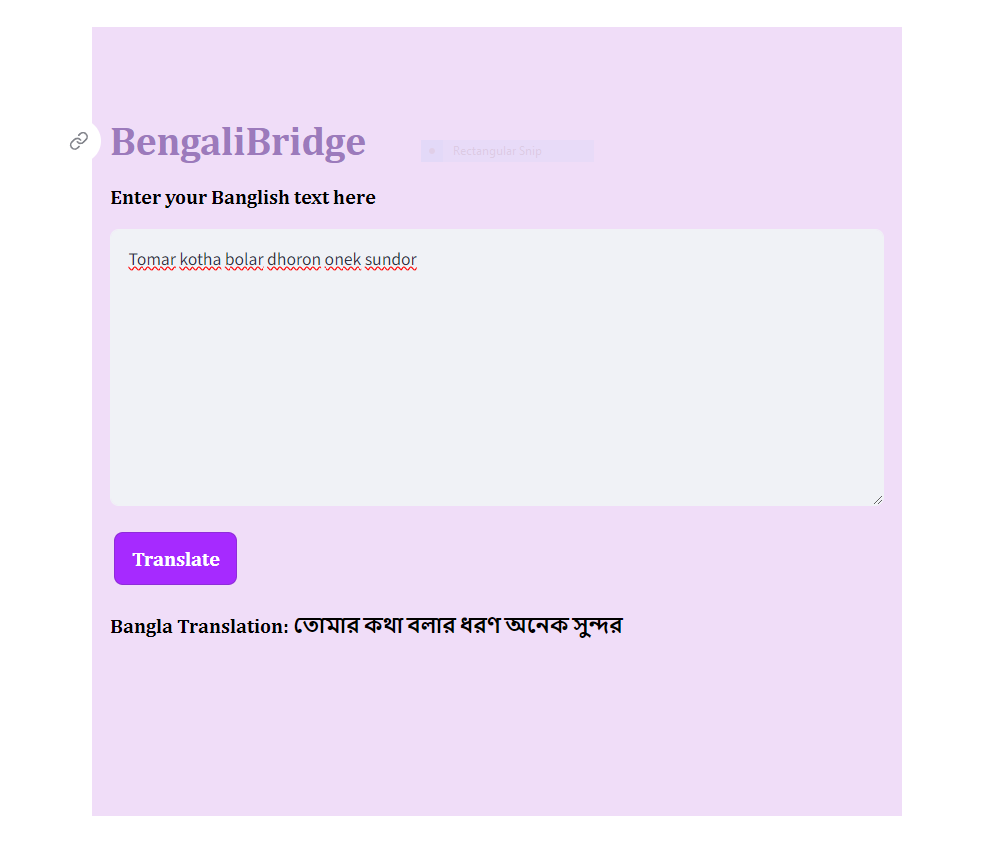

# Banglish to Bangla Machine Translation App using Streamlit



## About

This repository contains code for a machine translation app that translates Banglish (a mixture of Bengali and English) text to Bangla (Bengali) using Streamlit.

## Dataset Used

The Banglish to Bangla Machine Translation App utilizes the [Vashantor dataset](https://data.mendeley.com/datasets/bj5jgk878b/2) for training and evaluation.


## Features

- Translate Banglish text to Bangla.
- Simple and easy-to-use interface.
- Powered by pre-trained models for machine translation.

## How to Use

1. Clone this repository to your local machine:

   ```bash
   git clone https://github.com/your_username/Banglish-to-Bangla-Machine-Translation-App-using-Streamlit.git


